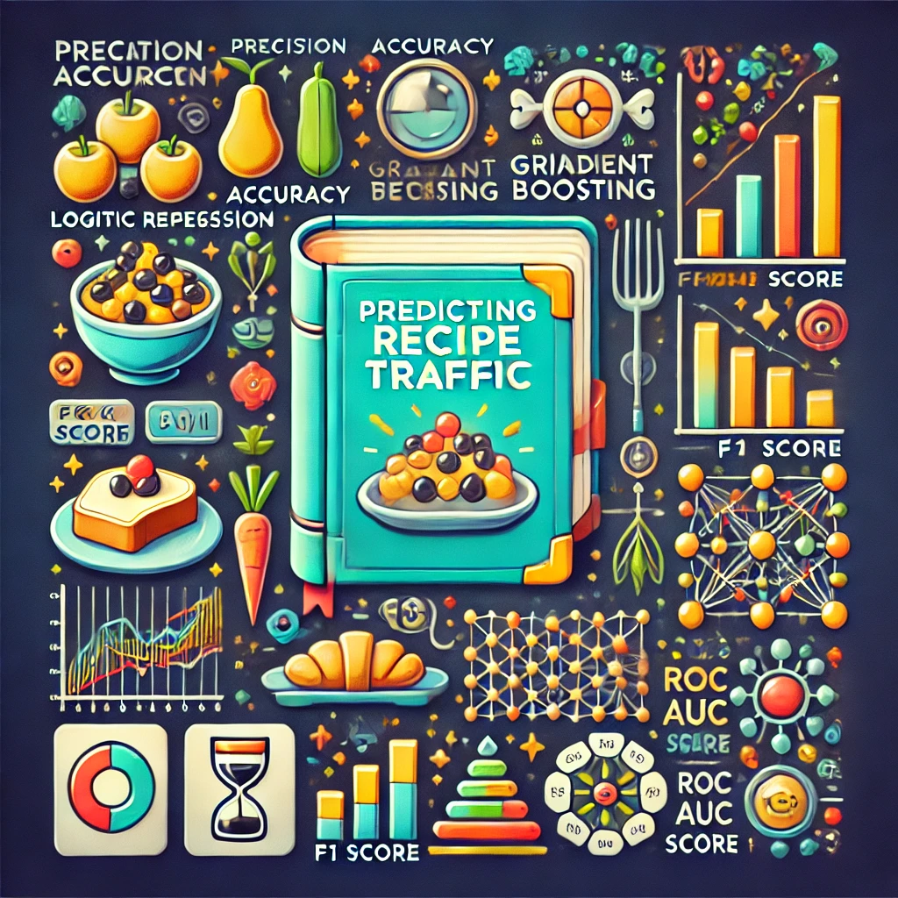

[Education](#education) | [Work Experience](#work-experience) | [Projects](#projects) | [Certificates](#certificates)

# Data Scientist & AI Engineer
Hi there! I’m a passionate data enthusiast with over five years of experience turning complex scientific data into meaningful insights. I love diving into data, uncovering patterns, and using advanced machine learning techniques to solve challenging problems. With a strong background in programming and visualization, I enjoy making data not only insightful but also easy to understand. I thrive on curiosity—always exploring new tools and technologies to stay ahead. Whether it's tackling tough analytical challenges or explaining technical concepts in a simple way, I’m all about making data work for people. Let’s connect and explore the power of data together!

### Education
- Ph.D. Mathematics, Iowa State University, May 2024
- Ms.C. Statistics, Iowa State University, December 2022

Here’s your **Work Experience** section with a more friendly and approachable tone:  

### Work Experience

- **AI Engineer @ Reality AI**  
  *Jun 2024 - Present*  
  - Built an **Intelligent Teaching Assistant** using **LLMs** and **Google Cloud Vertex AI** to create adaptive syllabus content and AI-resistant assignments.  
  - Designed **smart NLP pipelines** to process and organize large amounts of text, making automated content creation faster and more efficient.  

- **Data Scientist @ Iowa State University**  
  *Jun 2023 - May 2024*  
  - Automated **web scraping** with Selenium, cutting data extraction time by 60% and making data collection smoother.  
  - Improved **ETL workflows**, making data processing faster and more reliable for analysis.  

- **Data Analyst & Research Assistant @ Iowa State University**  
  *Aug 2017 - May 2023*  
  - Used **hierarchical logistic regression** to study how social connections impact immigrant students’ math enrollment.  
  - Built **statistical models** that helped improve teaching strategies by 21-36%.  
  - Led **data-driven projects**, applying advanced analytics to predict student performance with 86% accuracy.  

### Projects

- **[Udacity Data Scientist Program Capstone Project](https://coskunerden.github.io/Udacity_DS_Capstone_Project/)**
  - Built a predictive model to analyze user engagement with Starbucks' promotional offers.

    <!-- Adds spacing -->

  

- **[Kaggle Recipe Traffic Project](https://coskunerden.github.io/Kaggle_recipe/)**  
  - Developed machine learning models to predict recipe traffic based on nutritional content and categorical features.  

    <!-- Adds spacing -->
  
  
  

### Certificates

  <!-- Row 1 -->
  

    

      
<a href="https://www.udacity.com/certificate/e/78be004e-414d-11ef-b282-cb8cfd0cc463" target="_blank">
        Udacity Data Scientist Certificate</a> (Completed: December 2024)

      
      
Focused on machine learning, data engineering, recommendation systems, and deploying AI solutions using advanced tools. Developed expertise in Python programming, data analysis, and creating robust AI-driven solutions.

    

    

      
<a href="https://www.coursera.org/account/accomplishments/specialization/certificate/ZLRN24S8TJES" target="_blank">
        IBM Data Scientist Certificate</a> (Completed: April 2023)

      
      
Comprehensive training in data science methodologies, Python programming, SQL, and big data tools. Focused on data analysis, visualization, machine learning, and cloud-based solutions. Capstone project involved building machine learning models to solve real-world problems.

    

  

  <!-- Row 2 -->
  

    

      
<a href="https://www.datacamp.com/statement-of-accomplishment/track/f108efec1dfd7a23657a814ff4db852e2c78b942?raw=1" target="_blank">
        DataCamp Machine Learning Scientist Certificate</a> (Completed: June 2024)

      
      
Comprehensive expertise in supervised and unsupervised learning, deep learning with PyTorch, and building NLP pipelines. Gained practical skills in hyperparameter tuning, feature engineering, and deploying ML models.

    

    

      
<a href="https://www.datacamp.com/certificate/DS0025883108500" target="_blank">
        DataCamp Data Scientist Certificate</a> (Completed: March 2023)

      
      
Validated proficiency in core data science skills, including data management, exploratory analysis, statistical experimentation, and model development. Emphasized coding for production environments and project-based learning.

    

  

